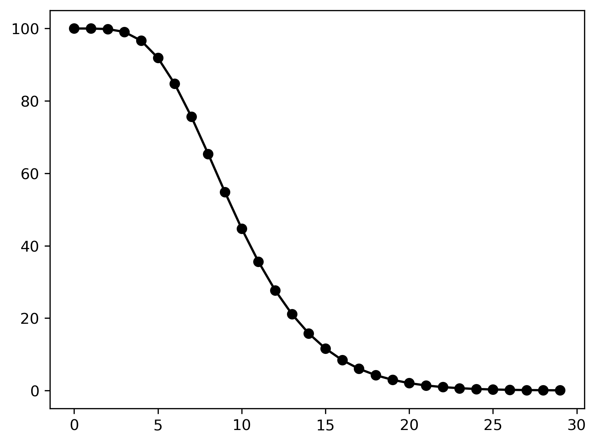
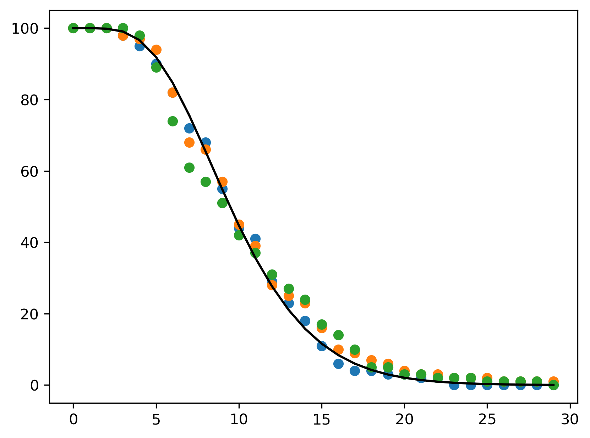
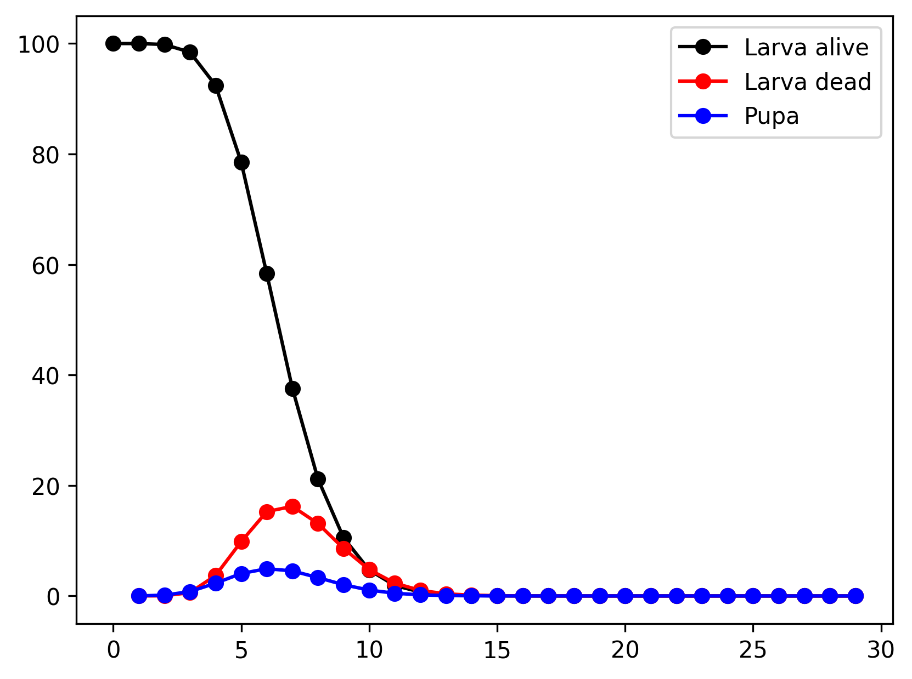
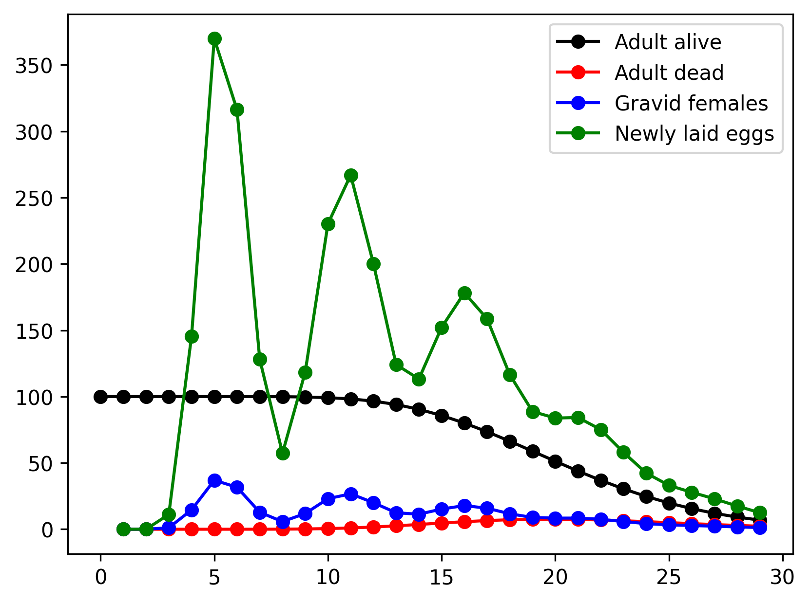
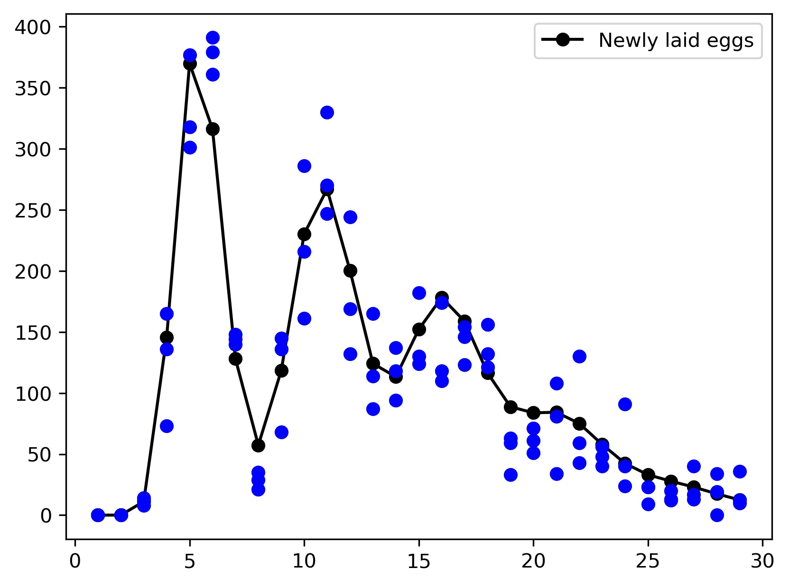
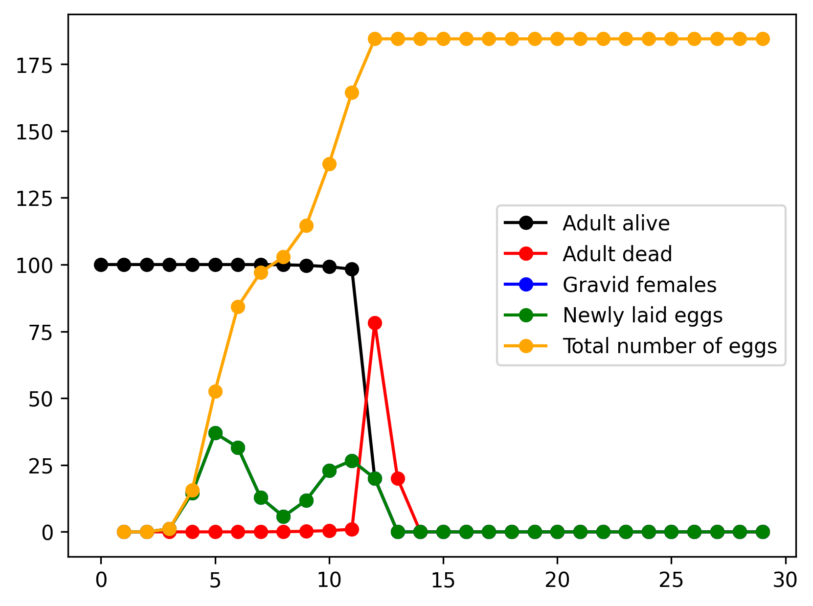

<style>
r { color: Red }
o { color: Orange }
g { color: Green }
.hidden {
    display: none;
}
pre.sourceCode {
    max-height: 300px;
}
.myFigures {
    display: flex;
}
.myFigures figure {
    width: 50%;
}
.myGroup {
    display: flex;
    flex-direction: column;
    width: 100%;
}
.myError,
.myCode,
.myJSON {
    width: 100%;
    height: 300px;
}
.myError {
    color: red;
    height: 100px;
}
.sourceCode {
    overflow: auto;
}
</style>

<script src="keparser.max.js"></script>
<script>
        function process(ids=["model","output","error"]) {
            var PopJSON = require('PopJSON');
            var parser = new PopJSON.PopJSON();
            let text = document.getElementById(ids[0]).value;
            let result = parser.parse_json(text);
            document.getElementById(ids[1]).value = result.model;
            document.getElementById(ids[2]).value = result.error;
        }
</script>

# PopJSON

We propose a JSON representation of dynamically-structured matrix population models, which can accommodate multiple processes, such as survival, development, and egg laying. At present, PopJSON deals only with the `sPop` models of Erguler et al. \[<a href="https://f1000research.com/articles/7-1220/v3" target="_blank" rel="noreferrer">sPop</a>, <a href="https://www.nature.com/articles/s41598-022-15806-2" target="_blank" rel="noreferrer">sPop2</a>, <a href="https://github.com/kerguler/Population" target="_blank" rel="noreferrer">Population</a>\], but soon, and with your help, it will expand to cover more.

## Using the library

The parser takes a JSON string, or a file, and converts it to its raw ANSI C equivalent. You'll then need to compile this in your system and run using the <a href="https://github.com/kerguler/Population" target="_blank" rel="noreferrer">Population</a> package. The package includes a wrapper for `Python`, and soon, will have another one for `R`.

We are working on developing the <a href="https://VEClim.com" target="_blank" rel="noreferrer">VEClim</a> API to take PopJSON requests and run sample simulations. But this shall be used to preview models. We will not reproduce the functionality of advanced analysis tools.

## Model definition

We first define the **model** with its **type** and **parameters**. algorithm (`Population` for now) and its parameters for simulation. The **deterministic** option will declare the model as either deterministic or stochastic. To set the precision of the accumulative process indicator, **istep** is used. This effectively limits the maximum number of pseudo-stage classes.
```json
{
    "model": {
            "title": "Climate-sensitive population dynamics of Aedes albopictus",
            "type": "Population",
            "url": "https://github.com/kerguler/Population",
            "deterministic": true,
            "parameters": {
                "algorithm": "Population",
                "istep": 0.01
            }
        }
}
```

### Declaring a population (or a development stage)

```json
{
    "populations": [
        {
            "id": "larva",
            "name": "The larva stage",
            "processes": [
                {
                    "id": "larva_dev",
                    "name": "Larva development time",
                    "arbiter": "ACC_ERLANG",
                    "value": [10, 4]
                }
            ]
        }
    ]
}
```
See [ex1a.json](./examples/ex1a.json) and [ex1a.c](./examples/ex1a.c) for the full PopJSON representation and the C translation.

<div class="myFigures">





</div>

### Declaring multiple processes

```json
{
    "populations": [
        {
            "id": "larva",
            "name": "The larva stage",
            "processes": [
                {
                    "id": "larva_mort",
                    "name": "Larva lifetime",
                    "arbiter": "ACC_ERLANG",
                    "value": [7, 2]
                },
                {
                    "id": "larva_dev",
                    "name": "Larva development time",
                    "arbiter": "ACC_ERLANG",
                    "value": [10, 4]
                }
            ]
        }
    ],
    "transformations": [
        {
            "id": "larva_death",
            "name": "Larva dying today",
            "value": ["larva_mort", "larva"]
        }, {
            "id": "larva_to_pupa",
            "name": "Larva developing into pupa",
            "value": ["larva_dev", "larva"]
        }
    ]
}
```
See [ex2a.json](./examples/ex2a.json) and [ex2a.c](./examples/ex2a.c) for the full PopJSON representation and the C translation.

The following **transformations** tag is needed to bind **larva_mort** to **larva_death** and **larva_dev** to **larva_to_pupa** to make them visible. Otherwise, only the size of the **larva** population is monitored.

```json
{
    "transformations": [
        {
            "id": "larva_death",
            "name": "Larva dying today",
            "value": ["larva_mort", "larva"]
        }, {
            "id": "larva_to_pupa",
            "name": "Larva developing into pupa",
            "value": ["larva_dev", "larva"]
        }
    ]
}
```



### Declaring cyclic development (gonotrophic cycle)

```json
{
    "populations": [
        {
            "id": "adult",
            "name": "Adult females",
            "processes": [
                {
                    "id": "adult_mort",
                    "name": "Adult lifetime",
                    "arbiter": "ACC_ERLANG",
                    "value": [20, 5]
                },
                {
                    "id": "adult_dev",
                    "name": "Egg development in adult females",
                    "arbiter": "ACC_ERLANG",
                    "value": [5, 1]
                }
            ]
        }
    ],
    "transfers": [
        {
            "id": "gonotrophic_cycle",
            "name": "Gonotrophic cycle",
            "from": "adult_dev",
            "to": "adult",
            "value": [["adult_mort", "adult"], "0"]
        }
    ],
    "transformations": [
        {
            "id": "adult_death",
            "name": "Adult females dying today",
            "value": ["adult_mort", "adult"]
        }, {
            "id": "num_gravid",
            "name": "Number of gravid females",
            "value": ["adult_dev", "adult"]
        },{
            "id": "egg_laying",
            "name": "Egg laying at the end of gonotrophic cycle",
            "value": ["*", "num_gravid", 10]
        }
    ]
}
```
See [ex3a.json](./examples/ex3a.json) and [ex3a.c](./examples/ex3a.c) for the full PopJSON representation and the C translation.




```json
{
    "model": {
            "deterministic": false,
        },
    "transformations": [
        {
            "id": "egg_laying",
            "name": "Egg laying at the end of gonotrophic cycle",
            "value": ["poisson", ["*", "num_gravid", 10]]
        }
    ]
}
```
See [ex3b.json](./examples/ex3b.json) and [ex3b.c](./examples/ex3b.c) for the full PopJSON representation and the C translation.



### Linking rates with pseudo-states

```json
{
    "populations": [
        {
            "id": "adult_num_dev",
            "name": "Number of gonotrophic cycles in adult females",
            "arbiter": "AGE_CUSTOM",
            "stepper": "NO_STEPPER",
            "hazard": ["NOAGE_CONST", ["?",[">","total_eggs",150],1,0], 0],
            "value": []
        }
    ]
}
```

```json
{
    "transfers": [
        {
            "id": "gonotrophic_cycle",
            "name": "Gonotrophic cycle",
            "from": "adult_dev",
            "to": "adult",
            "value": [["adult_mort", "adult"], 0, ["+", ["adult_num_dev", "adult"], 1]]
        }
    ]
}
```

```json
{
    "transformations": [
        {
            "id": "egg_laying",
            "name": "Egg laying at the end of gonotrophic cycle",
            "value": ["*", "num_gravid", 1]
        },{
            "id": "total_eggs",
            "name": "Total number of eggs laid",
            "value": ["+", "total_eggs", "egg_laying"]
        }
    ]
}
```

See [ex4a.json](./examples/ex4a.json) and [ex4a.c](./examples/ex4a.c) for the full PopJSON representation and the C translation.



# SandBox

<div class="myGroup">
<textarea id="model" class="myJSON">
</textarea>
<button onclick="process(['model','output','error'])">Parse</button>
<textarea id="output" class="myCode">
</textarea>
<textarea id="error" class="myError">
</textarea>
</div>

# Usage examples
