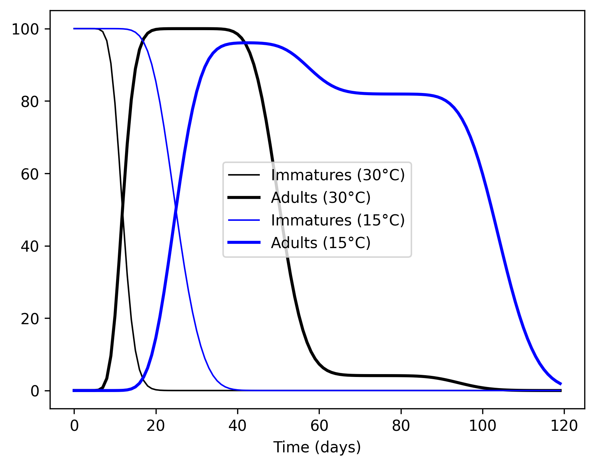
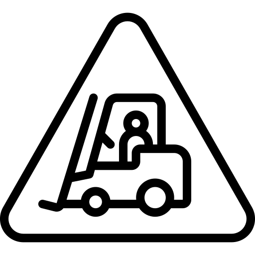

<style>
r { color: Red }
o { color: Orange }
g { color: Green }
.hidden {
    display: none;
}
pre.sourceCode {
    max-height: 300px;
}
.myFigures {
    display: flex;
}
.myFigures figure {
    width: 50%;
}
.myGroup {
    display: flex;
    flex-direction: column;
    width: 100%;
}
.myError,
.myCode,
.myJSON {
    width: 100%;
    height: 300px;
}
.myError {
    color: red;
    height: 100px;
}
.sourceCode {
    overflow: auto;
}
</style>

<script src="keparser.min.js"></script>
<script>
        function process(ids=["model","output","error"]) {
            var PopJSON = require('PopJSON');
            var parser = new PopJSON.PopJSON();
            let text = document.getElementById(ids[0]).value;
            let result = parser.parse_json(text);
            document.getElementById(ids[1]).value = result.model;
            document.getElementById(ids[2]).value = result.error;
        }
</script>

# PopJSON

We propose a JavaScript Object Notation (JSON) representation, named PopJSON, for communicating and storing population dynamics models. Ornamented with custom tags and operations, PopJSON describes the essentials of a dynamically-structured multi-process matrix population model. In its current implementation, PopJSON deals with the `sPop` models of Erguler et al. \[<a href="https://f1000research.com/articles/7-1220/v3" target="_blank" rel="noreferrer">sPop</a>, <a href="https://www.nature.com/articles/s41598-022-15806-2" target="_blank" rel="noreferrer">sPop2</a>, <a href="https://github.com/kerguler/Population" target="_blank" rel="noreferrer">Population</a>\], but soon will cover the canonical ODE and DDE models and more.
 
PopJSON requires a parser to translate it into code that can either be directly interpreted or compiled into an executable. For the <a href="https://github.com/kerguler/Population" target="_blank" rel="noreferrer">Population</a> package, the output should be raw ANSI C, however, many other canonical models can be parsed into R, Python, or any other scientific programming language.

In this repository, we included a <a href="https://github.com/kerguler/PopJSON/blob/main/wrappers/population.py" target="_blank" rel="noreferrer">wrapper</a> to read and simulate the translated models into `Python`. Soon, we will write another one for `R`.

We use the curly brackets \{\} throughout the text to group related tags and square brackets \[\] to define processess with a strict order. We hope all will be clearer as you read along.

## Model definition

We define a model sstarting with the **model** tag. Here, the key tags are **type** and **parameters**. In this version of PopJSON, we covered the **Population** model, but we are working on including more canonical ODE, DDE, etc. models.

The dynamics can either be deterministic or stochastic, which is determined using the boolean tag **deterministic**. If needed, we can set the precision of the accumulative process indicator (this is specific to the Population package) with the **istep** tag.  This effectively limits the maximum number of pseudo-stage classes.

Before following the steps below, we recommend having a look at the <a href="https://kerguler.github.io/Population/" target="_blank" rel="noreferrer">Population</a> package description.

```json
{
    "model": {
            "title": "Climate-sensitive population dynamics of Aedes albopictus",
            "type": "Population",
            "url": "https://github.com/kerguler/Population",
            "deterministic": true,
            "parameters": {
                "algorithm": "Population",
                "istep": 0.01
            }
        }
}
```

## Declaring a population (or a development stage)

A population, by definition, is a structured collection of similar individuals. There exists classes in a population that are invisible to the end user, but they distinguish intividuals into sub-groups. For example, an age-structured population of larvae is composed of indivudals all at their larva stage of development, however, some have been there for long but some have just started. The time they turn into pupae depends on how long they have been in the stage. 

```json
{
    "populations": [
        {
            "id": "larva",
            "name": "The larva stage",
            "processes": [
                {
                    "id": "larva_dev",
                    "name": "Larva development time",
                    "arbiter": "AGE_GAMMA",
                    "value": [10, 4]
                }
            ]
        }
    ]
}
```
See [ex1a.json](./examples/ex1a.json) and [ex1a.c](./examples/ex1a.c) for the full PopJSON representation and the C translation.

The above example represents a larva population with a development time of 10 days (with a standard deviation of 4 days). The population is age-structured and the development time is gamma-distributed.

Here, **AGE_GAMMA** refers to a specific population structure and development time distribution listed in <a href="https://kerguler.github.io/Population/#distributions-and-assumptions" target="_blank" rel="noreferrer">this</a> table. Accordingly, **AGE_GAMMA** takes two parameters, the mean and standard deviation of development. In the above PopJSON representation, these are given as the first and second elements of the list **value**.

<div class="myFigures">


</div>

## Dependence on environmental variables

Development is strongly dependent on temperature in many insect species. We have demonstrated that accumulative processes are suitable representations for development under variable environments (<a href="https://www.nature.com/articles/s41598-022-15806-2" target="_blank" rel="noreferrer">Erguler et al. 2022</a>). So, we will switch to **ACC_ERLANG** as the accumulative equivalent of the gamma-distributed age-structured development.

```json
{
    "populations": [
        {
            "id": "larva",
            "name": "The larva stage",
            "processes": [
                {
                    "id": "larva_dev",
                    "name": "Larva development time",
                    "arbiter": "ACC_ERLANG",
                    "value": ["d2m", "d2s"]
                }
            ]
        }
    ]
}
```
Please note that we declared the mean and standard deviation of development in terms of two variables, **d2m** and **d2s**, which we will define shortly.

Next, we define an environmental variable, temperature, to feed into our model.
```json
{    
    "environ": [
        {
            "id": "temp",
            "name": "Temperature of the breeding pool (in °C)",
            "url": ""
        }
    ]
}
```

What we need now is a function to transform temperature into the mean and standard deviation of development (to define **d2m** and **d2s**).
```json
{
    "functions": {
        "briere1": ["define", ["T","B","E","a"], ["?",["<=","T","B"],"365.0", ["?",[">=","T","E"],"365.0", ["min","365.0",["max","1.0", ["/","1.0",["exp", ["+","a",["log","T"],["log",["-","T","B"]],["*","0.5",["log",["-","E","T"]]]]]]]]]]],
    }
}
```

Please note that the function definition begins with **define**, which is a key word (an operator). The second in the list is the list of parameters (only a single letter for each), and the last is the equation. The mathematical equation notation were inspired from the <a href="https://cortexjs.io/math-json/" target="_blank" rel="noreferrer">MathJSON</a> representation of CortexJS. The list of all operators can be found <a href="#operators-for-equations">here</a>.

This is the reciprocal of the <a href="https://doi.org/10.1093/ee/28.1.22" target="_blank" rel="noreferrer">Briere-1</a> function commonly used in ecological modelling.
<p style="text-align: center; font-size: 1.5rem;"> 
$$ briere_1(T,a,L,R) = e^{-\left\{a + \ln(T) + \ln(T-L) + 0.5\ln(R-T)\right\}} $$
</p>
The function returns a large value (365 days of development) outside of **L** and **R** and stays within 1 and 365 for all **T**. Please note that the accumulative development algorithm in `Population` currently cannot handle mean process time smaller than a unit.

The Briere-1 function translates into the following C code:
```C
double dmin(double a, double b) { return a < b ? a : b; }
double dmax(double a, double b) { return a > b ? a : b; }

#define briere1(T,a,L,R) ((((T) <= (L))) ? (365.0) : ((((T) >= (R))) ? (365.0) : (dmin(365.0, dmax(1.0, (1.0 / exp(((a) + log((T)) + log(((T) - (L))) + (0.5 * log(((R) - (T))))))))))))
```

Next, we connect temperature with **d2m** and **d2s** using the **intermediates** tag. A key feature of this tag is that it computes first at the beginning of each iteration.

```json
{
    "intermediates": [
        {
            "id": "d2m",
            "value": ["briere1", ["index","temp","TIME_1"], "d2m_a", "d2m_b", "d2m_c"]
        }, {
            "id": "d2s",
            "value": ["*", "d2s_c", "d2m"]
        }
    ]
}
```

Here, **index** is an operator extracting the **TIME_1**<sup>th</sup> element in the array of **temp** (temperature). **TIME_1** refers to the previous time point (we used yesterday's conditions to estimate today's population).

Lastly, we define the **parameters** of the model to complete the temperature dependency of development time. For each, we declare an **id**, a **value**, and weather the parameter is fixed (**constant:true**) or user-defined (**constant:false**). Minimum an maximum values can also be defined using **min** and **max** tags, which could be useful when performing optimisation.


```json
{
    "parameters": [
        {
            "id": "d2m_a",
            "constant": false,
            "name": "Larva development mean (a)",
            "value": -15
        }, {
            "id": "d2m_b",
            "constant": false,
            "name": "Larva development mean (b)",
            "value": 10
        }, {
            "id": "d2m_c",
            "constant": false,
            "name": "Larva development mean (c)",
            "value": 35
        }, {
            "id": "d2s_c",
            "constant": false,
            "name": "Larva development stdev (c)",
            "value": 0.2
        }
    ]
}
```
See [ex1E.json](./examples/ex1E.json) and [ex1E.c](./examples/ex1E.c) for the full PopJSON representation and the C translation.

<div class="myFigures">


</div>

## Declaring multiple processes

The `Population` algorithm enables declaring multiple processes on a population. For instance, we could define lifetime and development time together having independent Erlang-distributed durations. Strinctly, they would not be completely independent as the processes take place in the order they are defined. This means that if we define development before larva mortality, pupa could be produced under conditions not suitable for larva survival. We do not what that I guess.

Here, we define the two processes for larva (in the plausible order) and follow the dynamics.

```json
{
    "populations": [
        {
            "id": "larva",
            "name": "The larva stage",
            "processes": [
                {
                    "id": "larva_mort",
                    "name": "Larva lifetime",
                    "arbiter": "ACC_ERLANG",
                    "value": [7, 2]
                },
                {
                    "id": "larva_dev",
                    "name": "Larva development time",
                    "arbiter": "ACC_ERLANG",
                    "value": [10, 4]
                }
            ]
        }
    ],
    "transformations": [
        {
            "id": "larva_death",
            "name": "Larva dying today",
            "value": ["larva_mort", "larva"]
        }, {
            "id": "larva_to_pupa",
            "name": "Larva developing into pupa",
            "value": ["larva_dev", "larva"]
        }
    ]
}
```
See [ex2a.json](./examples/ex2a.json) and [ex2a.c](./examples/ex2a.c) for the full PopJSON representation and the C translation.

The following **transformations** tag is needed to bind **larva_mort** to **larva_death** and **larva_dev** to **larva_to_pupa** to make them visible (remember that internal population structure is hidden by default). Otherwise, only the size of the **larva** population is monitored.

```json
{
    "transformations": [
        {
            "id": "larva_death",
            "name": "Larva dying today",
            "value": ["larva_mort", "larva"]
        }, {
            "id": "larva_to_pupa",
            "name": "Larva developing into pupa",
            "value": ["larva_dev", "larva"]
        }
    ]
}
```

The resulting larva population size and the number of larvae completing each process (mortality or pupa production) is given below.


# Advanced usage

We can do more with the `Populations` package, and here we describe a few interesting examples we could think of. Please <a href="https://github.com/kerguler/PopJSON/issues" target="_blank" rel="noreferrer">contact us</a> with requests or your own examples. Feel free to use the [SandBox](#sandbox) below.

## Declaring cyclic development (gonotrophic cycle)

Gonotrophic cycle is a complex process. After blood feeding, females develop eggs in their bodies and lay them before searching for blood again. To model the process, we define adult lifetime (**adult_mort**) and egg development (inside females) (**adult_dev**) for adult females.

```json
{
    "populations": [
        {
            "id": "adult",
            "name": "Adult females",
            "processes": [
                {
                    "id": "adult_mort",
                    "name": "Adult lifetime",
                    "arbiter": "ACC_ERLANG",
                    "value": [20, 5]
                },
                {
                    "id": "adult_dev",
                    "name": "Egg development in adult females",
                    "arbiter": "ACC_ERLANG",
                    "value": [5, 1]
                }
            ]
        }
    ],
    "transformations": [
        {
            "id": "adult_death",
            "name": "Adult females dying today",
            "value": ["adult_mort", "adult"]
        }, {
            "id": "num_gravid",
            "name": "Number of gravid females",
            "value": ["adult_dev", "adult"]
        },{
            "id": "egg_laying",
            "name": "Egg laying at the end of gonotrophic cycle",
            "value": ["*", "num_gravid", 10]
        }
    ]
}
```

When **adult_dev** is completed (in 5 days plus or minus 1), we will have the females ready for egg laying. Then, the number of eggs laid can be estimated by employing an average, for instance, 10 eggs per gravid female (as in **egg_laying**).

The problem, however, is the need to add the females back into the population. For this, we define a **transfer** tag, which transfers each sub-class from one population to another (here, from **adult_dev** back to **adult**).

```json
{
    "transfers": [
        {
            "id": "gonotrophic_cycle",
            "name": "Gonotrophic cycle",
            "from": "adult_dev",
            "to": "adult",
            "value": [1, [["adult_mort", "adult"], 0]]
        }
    ],
}
```

Before making the transfer, the algorithm allows us to declare the fraction of each sub-class to be transferred and to apply a transformation on the sub-class structure. This is defined in the **value** tag above as the first and second elements, respectively. Namely, all individuals should be transferred, the value of the process **adult_mort** (of **adult**) should stay as is, and **adult_dev** (the second one in the - second - list) should be reset to 0.

See [ex3a.json](./examples/ex3a.json) and [ex3a.c](./examples/ex3a.c) for the full PopJSON representation and the C translation ([ex3b.json](./examples/ex3b.json) and [ex3b.c](./examples/ex3b.c) for the stochastic version).

And, voila!


## Linking rates with pseudo-states

Using the `Population` package, we can define customised hazard functions to apply to every sub-class of a population. For instance, we can induce mortality based on a condition, let's say, if the total number of eggs laid exceeds 150.

```json
{
    "populations": [
        {
            "id": "adult_num_dev",
            "name": "Number of gonotrophic cycles in adult females",
            "arbiter": "AGE_CUSTOM",
            "stepper": "NO_STEPPER",
            "hazard": ["NOAGE_CONST", ["?",[">","total_eggs",150],1,0], 0],
            "value": []
        }
    ]
}
```

Once again, please refer to the <a href="https://kerguler.github.io/Population/" target="_blank" rel="noreferrer">Population</a> package description for **AGE_CUSTOM** and more. To recap, **AGE_CUSTOM** imposes an age-structured population with a unit stepper by default. This means, each sub-class ages one unit after each iteration. To prevent this, we select **stepper:NO_STEPPER**.

Then, we declare the hazard function based on a constant probability (probability of death). The **hazard** tag accepts a list of three elements: The base (**AGE_FIXED**, **AGE_CONST**, **AGE_GAMMA**, **AGE_NBINOM**, and **NOAGE_CONST**), the mean, and the standard deviation. The mean of **NOAGE_CONST** is sufficient to define mortality (the standard deviation is not used). In the above example, mortality is 1 if **total_eggs** (defined below) exceeds 150 (otherwise, 0).

Please note that **value: []** is required in order not to interfere with the parameters of other processes.

```json
{
    "transfers": [
        {
            "id": "gonotrophic_cycle",
            "name": "Gonotrophic cycle",
            "from": "adult_dev",
            "to": "adult",
            "value": [1, [["adult_mort", "adult"], 0, ["+", ["adult_num_dev", "adult"], 1]]]
        }
    ]
}
```

Above, we increment the **adult_num_dev** counter by one while transferring the females that have just laid eggs back to the host-seeking population.

Finally, we define **total_eggs** as the cumulative number of eggs laid. 

```json
{
    "transformations": [
        {
            "id": "egg_laying",
            "name": "Egg laying at the end of gonotrophic cycle",
            "value": ["*", "num_gravid", 1]
        },{
            "id": "total_eggs",
            "name": "Total number of eggs laid",
            "value": ["+", "total_eggs", "egg_laying"]
        }
    ]
}
```
See [ex4a.json](./examples/ex4a.json) and [ex4a.c](./examples/ex4a.c) for the full PopJSON representation and the C translation.


## Declaring class-dependent rates

The prevailing assumption of the `Population` algorithm is that the variability in a population is random. This essentially justifies the use of probability density functions (Erlang, Pascal, etc.) to determine exit times (process completion events).

It is possible, however, to treat certain groups of individuals separately, and assign them different rates. By using this feature, for instance, we can project the impact of larval development onto the adults produced. Let's consider a scenario where larvae taking longer to develop emerge as adults with longer life expectancies.

To represent this stage inheritance (as we call this in this context), we declare two populations, immatures and adults.
```json
{
    "populations": [
        {
            "id": "immat",
            "name": "The immature stages",
            "processes": [
                {
                    "id": "immat_mort",
                    "name": "Lifetime",
                    "arbiter": "ACC_ERLANG",
                    "value": [40, 5]
                },
                {
                    "id": "immat_dev",
                    "name": "Immature development time",
                    "arbiter": "ACC_ERLANG",
                    "value": ["d2m", "d2s"]
                }
            ]
        },
        {
            "id": "adult",
            "name": "The adult stage",
            "processes": [
                {
                    "id": "adult_mort",
                    "name": "Lifetime",
                    "arbiter": "ACC_ERLANG",
                    "value": [["?", [">", ["history", "adult"], 50], 80, 40], 5],
                    "hazpar": true
                },
                {
                    "id": "history",
                    "name": "Life as an immature",
                    "arbiter": "NOAGE_CONST",
                    "value": 0
                }
            ]
        }
    ]
}
```

Please note that we used the **d2m** and **d2s** parameters from the previous example to define immature development time as a function of temperature. To contain complexity, we define 40 days (plus or minus 5) of lifetime, which is independent of temperature. This means that the larvae are allowed to develop for 40 days max, then, they will start dying.

For the adult stage, we define mortality and a dummy process called **history**. We assign the **NOAGE_CONST** arbiter for this, which has no internal stepper (it won't interfere), and an integer counter, which we will describe shortly.

Please note the following two lines.
```json
{
                    "value": [["?", [">", ["history", "adult"], 50], 80, 40], 5],
                    "hazpar": true
}
```

We set **hazpar:true** to indicate that **value** applies to the sub-classes but not to the entire adult population. For each sub-class, distinguished with the counters of **adult_mort** and **history**, we define the mean lifetime as 80 (if **history** is larger than 50) or 40 (otherwise). In either case, the standard deviation of the Erlang-distributed lifetime is 5 days.

Where does **history** come from? Please have a look at the **transfers** declaration below.
```json
{
    "transfers": [
        {
            "id": "maturation",
            "name": "Adult emergence",
            "from": "immat_dev",
            "to": "adult",
            "value": [1, [0, ["round", ["*", "100.0", ["immat_mort","immat"]]]]]
        }
    ]
}
```

When immature stage development is complete, we take all those completing development (**immat_dev**) and add them to the **adult** stage by setting the **adult_mort** counter 0 (adult life has just started) and **history** a scaled version of **immat_mort**. For instance, if a group of individuals have spent 50\% of their lifetime in the immature stage, **history** of the adults will become 50. If development is faster, **history** will be smaller. Please note that the scaling is necessary as the **NOAGE_CONST** arbiter of **history** accepts an integer counter.

See [ex5a.json](./examples/ex5a.json) and [ex5a.c](./examples/ex5a.c) for the full PopJSON representation and the C translation.

Here is the output under two constant temperatures (15<sup>o</sup>C and 30<sup>o</sup>C)



The plot demonstrates that the majority of larva population complete development in less than 20 days when it is 30<sup>o</sup>C (black lines). This results in the production of adults with short lifetimes (most of them die in 40 days). On the other hand, when it is 15<sup>o</sup>C, the majority of larvae develop in more than 20 days, resulting in **history** becoming more than 50 (blue lines). Please note that, above, we defined average immature lifetime as 40, and, therefore, 50\% of lifetime as 20. Consequently, we see most of the emerging adults surviving for 80 days on average.

## Transfering only a fraction of a class


```json
{
    "transfers": [
        {
            "id": "gonotrophic_cycle",
            "name": "Gonotrophic cycle",
            "from": "adult_dev",
            "to": "adult",
            "value": [1, [["adult_mort", "adult"], 0]]
        }
    ],
}
```


## Genetic structure and inheritance

<p></img></p>
We are working on this. Please come back soon for updates.

# Operators for equations

| Operator    | Parameters    | Definition   |
| :---        | :---          | :---         |
| min         | a,b           | Minimum of two numbers |
| min         | a,b           | Maximum of two numbers |
| round       | a             | Rounds to the nearest integer |
| sqrt        | a             | Square root |
| pow         | a,b           | Power of a to b |
| exp         | a             | Exponential function |
| log         | a             | Natural logarithm |
| log2        | a             | Logarithm of a to base 2 |
| log10       | a             | Logarithm of a to base 10 |
| indicator   | a             | Indicator function (boolean to integer) |
| index       | a,b           | Value of an array at position b (counts from 0) |
| *           | ...           | Multiplication |
| +           | ...           | Addition |
| -           | ...           | Subtraction (in the given order) |
| /           | ...           | Division (in the given order) |
| size        | a             | Total size of a population |
| count       | a,b           | Sub-group counts of population **a** based on a logical check **b** of sub-group keys |
| poisson     | a             | Generates a Poisson random number with lambda=a (works only when **deterministic:false**) |
| binomial    | a,b           | Generates a Binomial random number with n=a and p=b (works only when **deterministic:false**) |
| define      | a,b           | Function definition with parameters a and equation b |
| ?           | a,b,c         | Condition expression (if a is true, return b, else, return c) |
| &&          | ...           | Logical AND |
| \|\|        | ...           | Logical OR |
| >           | a,b           | Logical greater than |
| <           | a,b           | Logical smaller than |
| >=          | a,b           | Logical greater than or equal |
| <=          | a,b           | Logical smaller than or equal |
| ==          | a,b           | Logical equal to |

# Examples

 - <a href="./examples/ex1a.json" target="_blank" rel="noreferrer">ex1a.json</a>
 - <a href="./examples/ex1b.json" target="_blank" rel="noreferrer">ex1b.json</a>
 - <a href="./examples/ex1E.json" target="_blank" rel="noreferrer">ex1E.json</a>
 - <a href="./examples/ex2a.json" target="_blank" rel="noreferrer">ex2a.json</a>
 - <a href="./examples/ex3a.json" target="_blank" rel="noreferrer">ex3a.json</a>
 - <a href="./examples/ex3b.json" target="_blank" rel="noreferrer">ex3b.json</a>
 - <a href="./examples/ex4a.json" target="_blank" rel="noreferrer">ex4a.json</a>
 - <a href="./examples/ex5a.json" target="_blank" rel="noreferrer">ex5a.json</a>

# SandBox

<div class="myGroup">
<textarea id="model" class="myJSON">
</textarea>
<button onclick="process(['model','output','error'])">Parse</button>
<textarea id="output" class="myCode">
</textarea>
<textarea id="error" class="myError">
</textarea>
</div>

